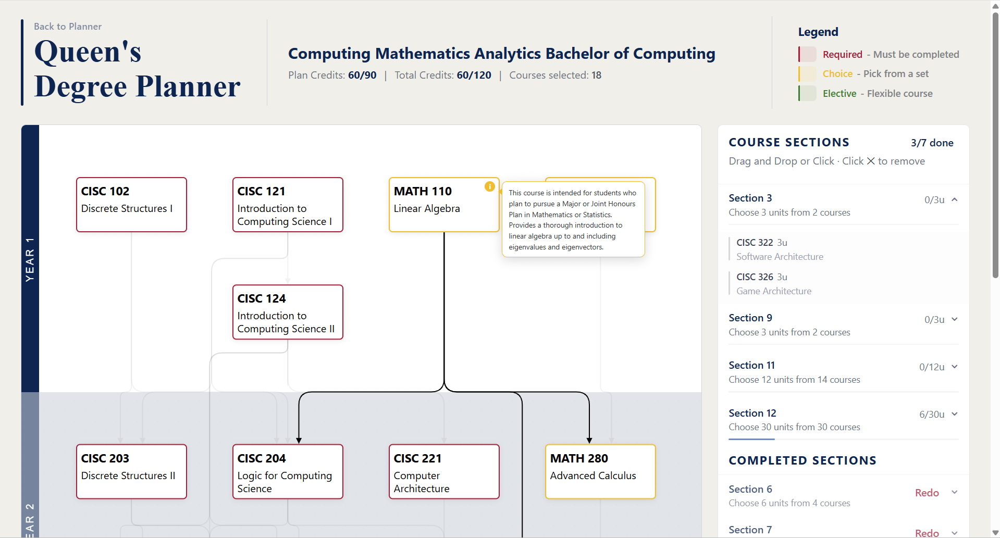

# Queen's Degree Planner

A full-stack web application designed to help Queen's University students plan their academic paths by providing intelligent course scheduling, prerequisite validation, and degree planning tools.

## 🎯 Project Overview

This project aggregates course and program data from multiple Queen's University sources, helping students navigate complex prerequisite chains and course dependencies throughout a 3 or 4-year degree.

**Data Sources:**
- [Program structures](https://www.queensu.ca/academic-calendar/arts-science/schools-departments-programs/)
- [Course descriptions](https://www.queensu.ca/academic-calendar/arts-science/course-descriptions/)
- [Academic rules & calendar](https://www.queensu.ca/academic-calendar/arts-science/academic-programs/)
- [Plan selection guidelines](https://www.queensu.ca/artsci/undergraduate/first-year-students/plan-selection)

**Degree Planning Dashboard**



**Features**
- Interactive semester planner with drag-and-drop course scheduling
- Real-time prerequisite validation and cascade removal
- Visual degree progress tracking
- Credit limit enforcement (per-year, per-section, and degree total)
- Implements Queen's academic calendar plan logic

---

## 🎓 Planner Logic

The planner implements the academic rules found in the Queen's Faculty of Arts and Science Academic Calendar.

### Degree Programs

Queen's Arts & Science offers 9 degree programs:

| Degree | Code | Units Required |
|--------|------|---------------|
| Bachelor of Arts (Honours) | BAH | 120.0 |
| Bachelor of Arts | BA | 90.0 |
| Bachelor of Computing (Honours) | BCH | 120.0 |
| Bachelor of Computing | BCP | 90.0 |
| Bachelor of Fine Art (Honours) | BFH | 120.0 |
| Bachelor of Music | BMS | 120.0 |
| Bachelor of Music Theatre | BMT | 90.0 |
| Bachelor of Science (Honours) | BSH | 120.0 |
| Bachelor of Science | BSC | 90.0 |

> Note: BFH closed to new admissions in September 2023 but remains supported for existing students.

### Plan Types

Each degree is built from one or more modular plan types:

- **Specialization** — Honours specialization in a subject
- **Major** — Major in a subject
- **Minor** — Minor in a subject
- **General** — Three-year general degree path (no honours)

### Supported Plan Combinations

| Combination | Notes |
|---|---|
| Specialization | Single honours specialization |
| Specialization + Minor | Honours specialization paired with one minor |
| Major | Standalone major (only when exceeding the minimum unit threshold: 48 for BAH, 60 for BSH/BCH) |
| Major + Minor | One major paired with one minor |
| Major + Double Minor | One major paired with two distinct minors |
| Double Major | Two majors pursued simultaneously |
| General | Three-year degree without honours |

Combinations like two specializations or two majors and a minor are not permitted — the plan selection UI enforces this structurally.

### General Rules

The calander enforces some general rules about your degree. While they are not necessarily true for every student or degree, they are typical for most Queen's students. 

- Per-year credit cap: **30.0 units**
- Total degree cap: **120.0 units**
- The total units of courses taken in a section cannot excede the limit set for that section.
- The calander will not schedule a course that has a prerequisite chain depth of two or greater in the same year. This represents how a dual semester year only allows for two courses to be taken if all courses have a prerequisite to the other.
- The calander places courses in years based off their course code. i.e CISC-300, at it's earliest is placed in year 3.


### Credit Double-Counting Rules

The planner implements Queen's two-part double-counting policy (Academic Calendar, Academic Programs section 2):

- **Rule 2a — Common Courses**: a course that is a core/option requirement in two or more plans may be counted toward both, up to a combined cap of **12.0 units**.
- **Rule 2b — Supporting Courses**: a course that is a supporting requirement in one plan and a mandatory requirement in another may be counted toward both, with **no unit cap**.

Rule 2b takes priority when a course qualifies under both rules.

### Non-Enforced Rules/Design Choices

- The breadth requirement (18.0 units across three subjects within the first 30.0 units) is **not enforced** by this planner.
- Option lists found in some plans are treated as subplans.
- As courses must be taken on a per semester basis, and course semester data is not available for public use. The planner does not place courses into semesters.
- Courses in required sections of your program will also count towards non-required sections.

---

## 🏗️ Architecture Overview

### Tech Stack

| Layer | Technology | Version |
|-------|-----------|---------|
| **Frontend** | React + TypeScript + Vite | React 18+ |
| **Backend** | Python FastAPI | 0.104+ |
| **Database** | MySQL | 8.0+ |
| **HTTP** | RESTful API | JSON |

### Backend

A Python **FastAPI** application that serves the core academic and data layer:

- **REST API** — Endpoints for courses, programs, and prerequisites
- **Web scrapers** — Automated tools to pull and parse program structures and course descriptions from the Queen's Academic Calendar
- **Database layer** — Stores and queries academic data (MySQL)

**Key files** (in `app/`):
- `main.py` — FastAPI application entry point and route configuration
- `models/` — SQLAlchemy data models (Course, Program, Prerequisite)
- `schemas/` — Pydantic request/response schemas for API validation
- `routers/` — API endpoint definitions (courses, programs, recommendations)
- `scrapers/` — Queen's Calendar web scrapers and parsers
- `services/` — Business logic (recommendation engine, prerequisite parsing, data transformations)
- `queries/` — Database query builders and complex lookups

### Frontend

A **React + TypeScript** single-page application (SPA) built with **Vite** that provides an interactive degree planning interface:

- **Interactive planner** — Drag-and-drop course scheduling with real-time validation
- **State management** — Zustand store (`planStore.ts`) for plan persistence
- **Client-side validation** — Prerequisite checking, credit calculations, degree rules

**Key utilities**

*State & Storage:*
- `planStore.ts` — Zustand store managing plan state and persistence

*Degree & Prerequisite Logic:*
- `program.ts` — Course placement rules and degree constraints
- `programCombination.ts` — Plan combination selection and credit double-counting rules
- `prerequisites.ts` — Prerequisite chain resolution and dependency checking
- `graph.ts` — Prerequisite graph traversal, cycle detection, and topological sorting of nodes

*Helpers:*
- `credits.ts` — Credit calculations and per-year/section limit enforcement
- `coursePlanLayout.ts` — Preset values to control calander layout
- `coursePlanConverter.ts` — Converts between API responses and UI course objects

---

## 🚀 Getting Started

### Prerequisites

- Node.js 18+
- Python 3.10+
- MySQL 8.0+

### Installation

```bash
# Clone the repository
git clone https://github.com/Erose112/Queens-U-Degree-Planner.git
cd queens-degree-planner

# Install frontend dependencies
cd frontend
npm install

# Install backend dependencies
cd ../backend
pip install -r requirements.txt
```

### Configuration

Copy `.env.example` to `.env` in both `frontend/` and `backend/` and fill in your database credentials and API base URL.

### Running Locally

**Terminal 1 — Backend API:**
```bash
cd backend
uvicorn app.main:app --reload
```
Server runs on `http://localhost:8000`

**Terminal 2 — Frontend Dev Server:**
```bash
cd frontend
npm run dev
```
App runs on `http://localhost:5173`

---

## ⚖️ Legal & Attribution

This project scrapes publicly available course data from Queen's University for educational purposes. The project:

- Endeavours to respect `robots.txt` guidelines
- Implements request delays to avoid server strain
- Is non-commercial and educational in nature

**Data Source**: Queen's University Academic Calendar

---

## 📝 License

This project is licensed under the MIT License.

## 👤 Author

**Ethan Rose**
- Email: ethan.rose.to@gmail.com

---

**Last Updated**: May 2026
**Current Version**: 1.0.0-rc